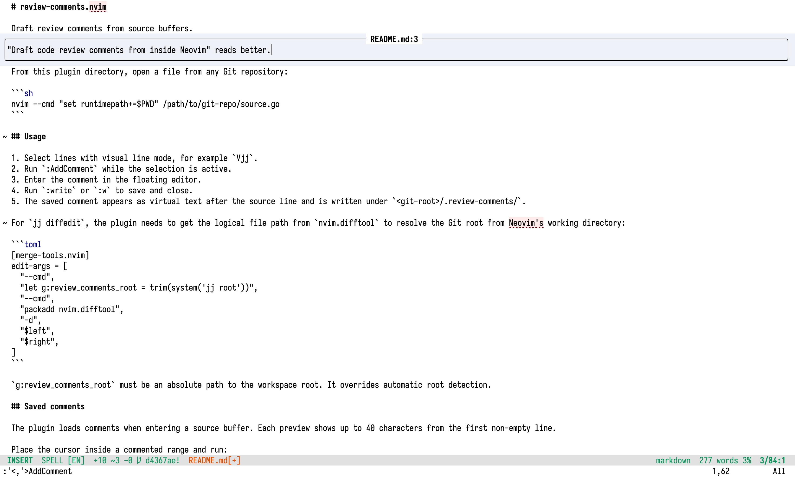
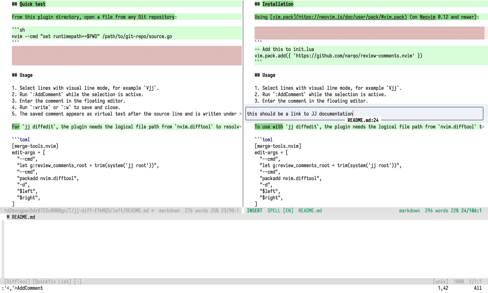

# review-comments.nvim

Draft code review comments from inside [Neovim](https://neovim.io/).

## Examples

Comment a line (or a range of lines) in any file in the workspace:



_Colour scheme: [classylight](https://github.com/narqo/classylight.vim)_

You can add a comment from the diff too:



Each comment is stored in a separate Markdown file with JSON frontmatter in the `.review-comments` directory inside the workspace root.
You can then point your coding agent to the stored comments, and ask it to address and to resolve each of them.

## Installation

Using [vim.pack](https://neovim.io/doc/user/pack/#vim.pack) (on Neovim 0.12 and newer):

```
-- Add this to init.lua
vim.pack.add({ 'https://github.com/narqo/review-comments.nvim' })
```

## Usage

1. Select lines with visual line mode, for example `Vjj`.
2. Run `:AddComment` while the selection is active.
3. Enter the comment in the floating editor.
4. Run `:write` or `:w` to save and close.
5. The saved comment appears as virtual text after the source line and is written under `<git-root>/.review-comments/`.

To use with [`jj diffedit`](https://jj-vcs.github.io/jj/latest/cli-reference/#jj-diffedit), the plugin needs the logical file path from `nvim.difftool` to resolve the Git root from Neovim's working directory:

```toml
[merge-tools.nvim]
edit-args = [
  "--cmd",
  "let g:review_comments_root = trim(system('jj root'))",
  "--cmd",
  "packadd nvim.difftool",
  "-d",
  "$left",
  "$right",
]
```

`g:review_comments_root` must be an absolute path to the workspace root. It overrides automatic root detection.

Run `jj diffedit` and add comments in a any normal buffer:

```
jj diffedit --tool=nvim
```

## Saved comments

The plugin loads comments when entering a source buffer. Each preview shows up to 40 characters from the first non-empty line.

Place the cursor inside a commented range and run:

```vim
:ViewComment
```

Reload comments created, changed, or removed externally with:

```vim
:RefreshComment
```

## Addressing comments

The agent skill at `.agents/skills/review-comment-inbox/SKILL.md` allows coding agents to inspect, address, test, and remove resolved comments.

In [pi](https://pi.dev/), start it explicitly with:

```text
/skill:review-comment-inbox
```

## Configuration

> [!CAUTION]
> Exposed configuration options are experimental.

```lua
require("review-comments").setup({
  output_dir = ".review-comments",
  keymap = "<leader>ac",
})
```

## Testing

### Quick test

From this plugin directory, open a file from any Git repository:

```sh
nvim --cmd "set runtimepath+=$PWD" /path/to/git-repo/source.go
```

## Automated testing

```sh
make test
```

## License

[MIT](LICENSE)
